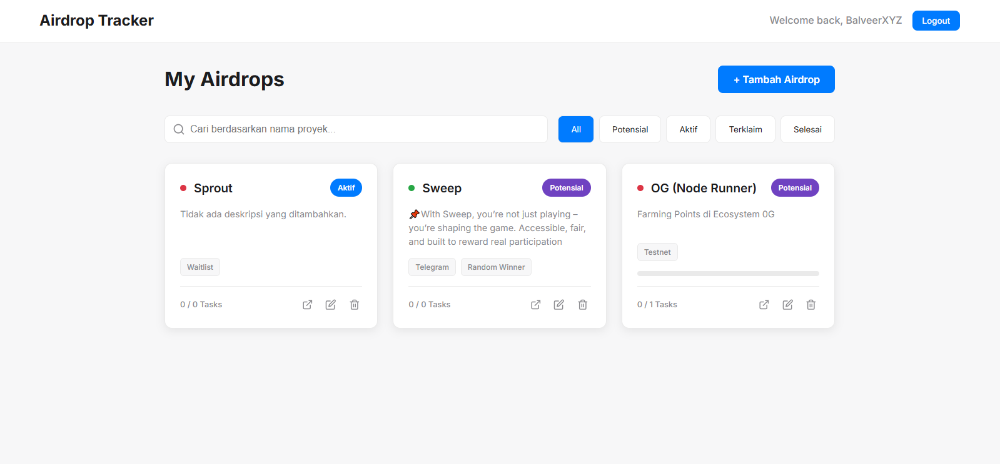
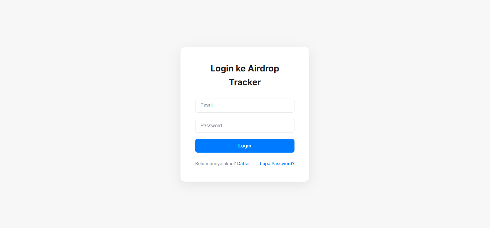
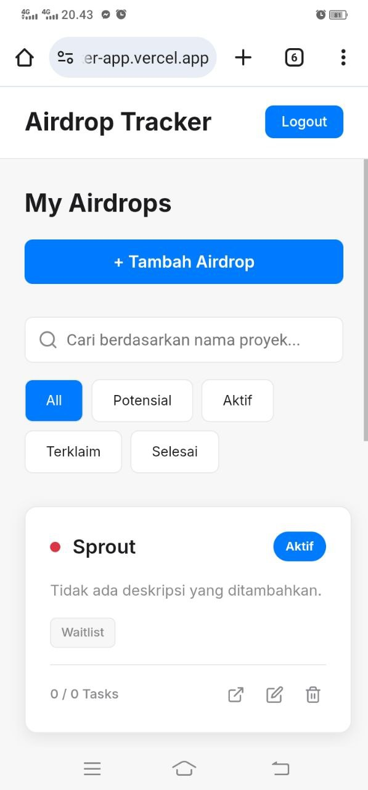

# Airdrop Tracker Management



**Airdrop Tracker Management** adalah aplikasi web full-stack yang dirancang untuk membantu para penggemar cryptocurrency melacak, mengelola, dan memaksimalkan partisipasi mereka dalam berbagai event airdrop. Dibangun dengan tumpukan teknologi modern, aplikasi ini menawarkan antarmuka yang bersih, responsif, dan kaya fitur untuk memastikan tidak ada peluang airdrop yang terlewatkan.

**Lihat demonya secara langsung:** [airdrop-tracker-app.vercel.app](https://airdrop-tracker-app.vercel.app/)

---

## ✨ Fitur Utama

Aplikasi ini dilengkapi dengan semua alat yang Anda butuhkan untuk mengelola perjalanan airdrop Anda secara efisien:

*   **🔐 Autentikasi Aman:** Sistem pendaftaran dan login yang aman menggunakan Supabase Auth, lengkap dengan fitur "Lupa Password".
*   **📊 Dasbor Intuitif:** Tampilan utama yang bersih untuk melihat semua airdrop Anda dalam bentuk kartu yang informatif.
*   **✅ Manajemen Airdrop Penuh (CRUD):** Tambah, lihat, edit, dan hapus data airdrop dengan mudah melalui antarmuka modal yang modern.
*   **🔍 Pencarian & Filter Cepat:** Temukan airdrop secara instan dengan pencarian berdasarkan nama atau filter berdasarkan status (`Potensial`, `Aktif`, `Terklaim`, `Selesai`).
*   **📌 Prioritas & Penandaan:** Tetapkan level prioritas (`Tinggi`, `Sedang`, `Rendah`) dan tambahkan *tag* kustom (misalnya, `Testnet`, `DeFi`, `NFT`) untuk pengorganisasian yang lebih baik.
*   **📝 Checklist Tugas Interaktif:** Buat daftar tugas untuk setiap airdrop (misalnya, "Follow Twitter", "Join Discord") dan lacak progres penyelesaiannya dengan *progress bar* visual.
*   **🔗 Akses Cepat ke Proyek:** Simpan URL proyek airdrop dan akses langsung dari kartu dasbor dengan satu klik.
*   **📱 Desain Responsif Penuh:** Tampilan yang dioptimalkan untuk pengalaman pengguna yang mulus di perangkat desktop, tablet, maupun mobile.

---

## 🛠️ Tumpukan Teknologi (Tech Stack)

Proyek ini dibangun menggunakan teknologi modern yang cepat, andal, dan mudah dikembangkan:

*   **Frontend:**
    *   [**React**](https://reactjs.org/) - Library JavaScript untuk membangun antarmuka pengguna.
    *   [**Vite**](https://vitejs.dev/) - Build tool generasi baru yang sangat cepat.
    *   [**Styled-components**](https://styled-components.com/) - Untuk styling CSS-in-JS yang terenkapsulasi dan dinamis.
    *   [**React Router**](https://reactrouter.com/) - Untuk routing di sisi klien.
*   **Backend & Database:**
    *   [**Supabase**](https://supabase.io/) - Platform open-source alternatif Firebase yang menyediakan database PostgreSQL, autentikasi, dan API instan.
*   **Deployment:**
    *   [**Vercel**](https://vercel.com/) - Platform untuk deployment frontend dengan CI/CD otomatis yang terintegrasi dengan GitHub.

---

## 🚀 Instalasi & Menjalankan Secara Lokal

Untuk menjalankan proyek ini di lingkungan lokal Anda, ikuti langkah-langkah berikut:

1.  **Clone repositori ini:**
    ```bash
    git clone https://github.com/airdrop-888/airdrop-tracker-app.git
    cd airdrop-tracker-app
    ```

2.  **Install dependensi:**
    ```bash
    npm install
    ```

3.  **Setup variabel lingkungan:**
    *   Buat akun di [Supabase](https://supabase.io/) dan buat proyek baru.
    *   Jalankan query SQL yang ada di dalam `database_schema.sql` (Anda perlu membuat file ini) untuk membuat tabel `airdrops`.
    *   Buat file `.env.local` di root proyek.
    *   Salin dan tempelkan konten di bawah ini ke dalam `.env.local`, lalu ganti dengan kunci API Supabase Anda:
      ```env
      VITE_SUPABASE_URL="URL_PROYEK_SUPABASE_ANDA"
      VITE_SUPABASE_ANON_KEY="KUNCI_ANON_SUPABASE_ANDA"
      ```

4.  **Jalankan server development:**
    ```bash
    npm run dev
    ```
    Aplikasi sekarang akan berjalan di `http://localhost:5173`.

---

## 📸 Screenshot

| Tampilan Login | Dasbor Mobile |
| :---: | :---: |
|  |  |

---

Terima kasih telah melihat proyek ini!
